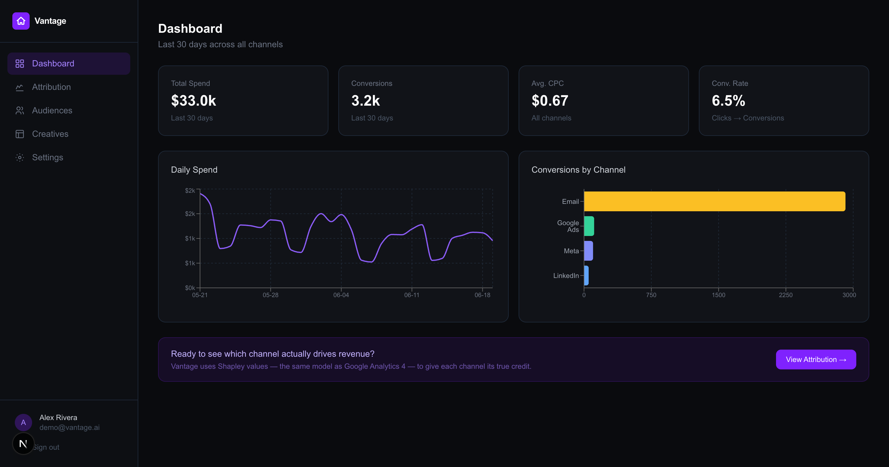
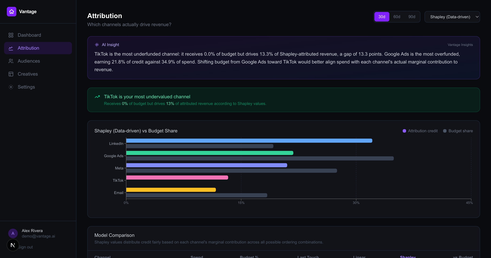
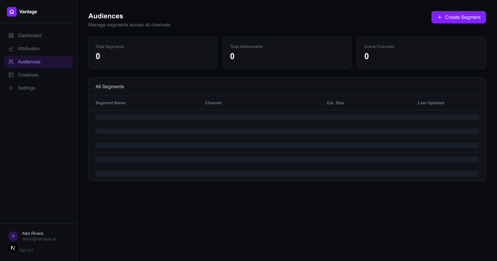
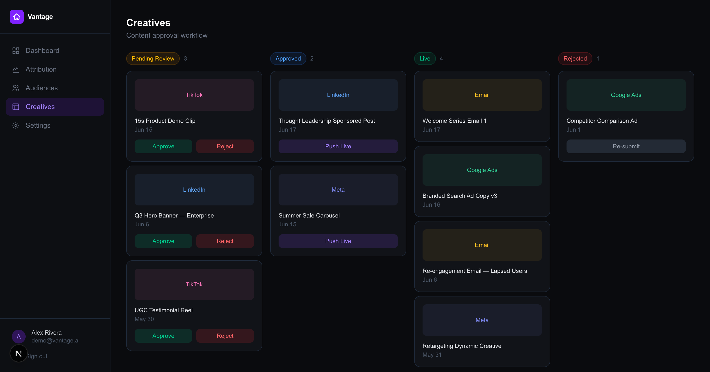
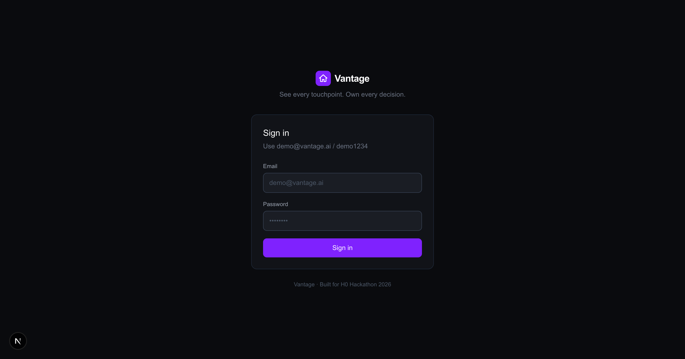
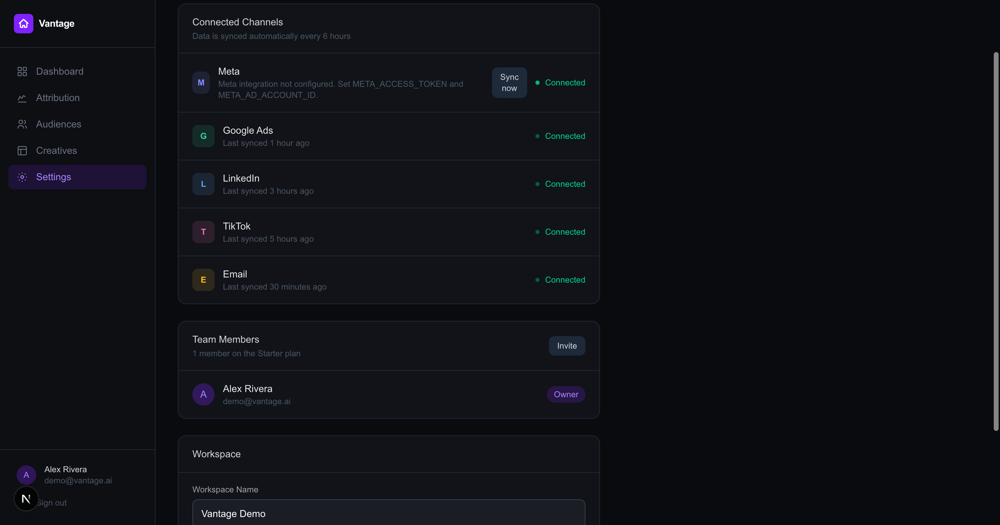
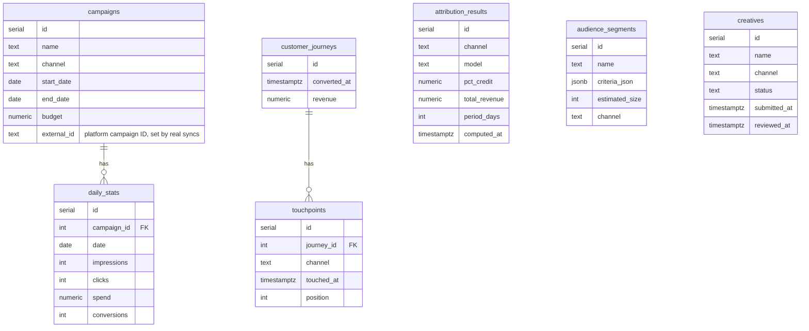

<div align="center">

# Vantage

**See every touchpoint. Own every decision.**

A B2B marketing intelligence platform that tells you which channel *actually* drives revenue — using Shapley-value attribution, the same game-theoretic model behind Google Analytics 4.

[](https://vantage-six-roan.vercel.app)


Built for **H0: Hack the Zero Stack with Vercel v0 and AWS Databases**

</div>

---

## The problem

A B2B marketing team runs Meta, Google Ads, LinkedIn, TikTok, and Email campaigns in parallel. Every platform's dashboard claims its own campaigns drove the conversion — last-touch attribution gives nearly all the credit to whichever channel closed the deal, even if four other channels did the work to get the buyer there. Teams routinely overfund the channel that closes and defund the channels that actually build the pipeline.

## The insight

Vantage replaces last-touch guessing with **Shapley values** — it treats each customer journey as a coalition game, computes every channel's marginal contribution across every possible ordering of touchpoints, and credits revenue accordingly.

On the live seed data, this surfaces a concrete, demo-ready "aha":

> **LinkedIn receives 19.2% of total ad spend but earns 32.5% of Shapley-attributed revenue** — a +13.3 point gap that last-touch and linear models both miss.

| Channel | Spend share | Last-touch credit | Linear credit | **Shapley credit** | vs. budget |
|---|---|---|---|---|---|
| LinkedIn | 19.2% | 35.9% | 35.2% | **32.5%** | 🟢 +13.3% |
| Google Ads | 34.9% | 19.7% | 21.6% | **21.5%** | 🔴 −13.4% |
| Meta | 27.5% | 21.6% | 19.7% | **20.8%** | 🔴 −6.7% |
| Email | 18.4% | 13.0% | 11.0% | **11.9%** | 🔴 −6.5% |
| TikTok | 0% | 9.9% | 12.5% | **13.3%** | 🟢 +13.3% |

*(Live numbers from `/api/attribution?days=30` against the seeded Aurora dataset — re-run `shapley.py` and these will change.)*

---

## Screenshots

<table>
<tr>
<td width="50%">

**Dashboard** — spend, conversions, CPC, conversion rate, and a real-time anomaly banner (CPC spikes, spend swings, conversion-rate drops vs. the prior week)



</td>
<td width="50%">

**Attribution** — Shapley vs. last-touch vs. linear, with an AI-generated executive insight (Amazon Bedrock, template fallback) above the undervalued-channel callout



</td>
</tr>
<tr>
<td width="50%">

**Audiences** — full CRUD segment builder backed by Aurora



</td>
<td width="50%">

**Creatives** — Kanban-style creative approval workflow



</td>
</tr>
<tr>
<td width="50%">

**Login** — NextAuth credentials provider, single demo account



</td>
<td width="50%">

**Settings** — connected-channel status, team, and a live "Sync now" trigger for the Meta Marketing API connector



</td>
</tr>
</table>

---

## Try it live

**[vantage-six-roan.vercel.app](https://vantage-six-roan.vercel.app)**

```
Email:    demo@vantage.ai
Password: demo1234
```

---

## Architecture

```mermaid
flowchart LR
    User["Browser"] -->|HTTPS| Vercel["Vercel Edge<br/>Next.js App Router"]
    Vercel -->|NextAuth.js credentials| Auth["Session cookie<br/>JWT"]
    Vercel -->|"pg (node-postgres)<br/>TLS via aws-ssl-profiles"| Aurora[("Amazon Aurora<br/>PostgreSQL Serverless v2")]
    Vercel -->|InvokeModel| Bedrock["Amazon Bedrock<br/>Claude 3.5 Haiku"]
    Cron["Vercel Cron<br/>daily"] -->|"GET /api/cron/<br/>recompute-attribution"| Vercel
    Cron -->|"TS Shapley engine<br/>+ REFRESH MATVIEW"| Aurora
    Meta["Meta Marketing API"] -->|"Sync now"<br/>(Settings page)| Vercel
    Seed["Python<br/>seed.py"] -->|"synthetic seed data"| Aurora
    Aurora -->|"campaigns, daily_stats,<br/>touchpoints, journeys"| Vercel

    style Aurora fill:#527FFF,color:#fff
    style Vercel fill:#000,color:#fff
    style Bedrock fill:#FF9900,color:#000
    style Cron fill:#000,color:#fff
    style Meta fill:#1877F2,color:#fff
    style Seed fill:#3776AB,color:#fff
```

Every page is server-rendered or API-backed by direct SQL against Aurora — there is no caching layer and no mock data path in production. Three pieces run out-of-band on a schedule rather than per-request: a **Vercel Cron job** recomputes Shapley/last-touch/linear attribution and refreshes the dashboard rollup daily (`app/api/cron/recompute-attribution`), an **Amazon Bedrock** call turns the attribution comparison into a plain-English executive insight on demand (`app/api/attribution/insight`), and a **Meta Marketing API sync** pulls real campaign/spend/conversion data into the same `campaigns`/`daily_stats` tables the seeded data lives in, triggered from the Settings page.

### Why Aurora PostgreSQL

The anomaly-detection and attribution queries lean on window functions, `FILTER`, and multi-CTE aggregation over tens of thousands of touchpoint rows — exactly the analytical workload Aurora PostgreSQL is built for, and the same engine class enterprises run this kind of pipeline on in production. Serverless v2 also means the demo database scales to zero between hackathon judging sessions instead of idling at full cost.

### Scaling past the demo

Three deliberate decisions target the gap between "hackathon demo" and "doesn't fall over with real traffic":

- **Materialized rollup.** The dashboard's hottest query (`daily_stats` JOIN `campaigns`, GROUP BY channel/date) is pre-aggregated into `channel_daily_rollup`, refreshed via `REFRESH MATERIALIZED VIEW CONCURRENTLY` so refreshes never block live reads. See `schema.sql`.
- **Channel count stops being hardcoded.** The original Python engine hardcoded 5 channels; the TypeScript port (`lib/attribution/shapley.ts`) derives the channel set from `SELECT DISTINCT channel FROM touchpoints`, so adding Google Ads or LinkedIn via real API sync doesn't require a code change.
- **Exact enumeration degrades gracefully.** Shapley's exact computation is `O(n · 2^(n-1))` — fine at 5 channels, infeasible past ~20. Past `EXACT_CHANNEL_LIMIT` (12), the engine switches to Monte Carlo permutation sampling (20,000 samples), which converges to the same value in bounded time regardless of channel count.

---

## Database schema



`touchpoints` and `customer_journeys` are the only tables `shapley.py` (or its TypeScript port) reads from; everything it produces lands in `attribution_results`, keyed uniquely on `(channel, model, period_days)` so re-runs upsert cleanly. `campaigns.external_id` is unique per `(channel, external_id)` when set, so the Meta sync route can upsert a campaign on every run instead of duplicating it. `channel_daily_rollup` is a materialized view (not pictured above) pre-aggregating `daily_stats` by channel/day for the dashboard. Full DDL: [`../schema.sql`](../schema.sql).

---

## Tech stack

| Layer | Choice | Why |
|---|---|---|
| Frontend | Next.js 16 (App Router) + React 19 + TypeScript | Route groups (`(dashboard)`) keep the authenticated shell separate from `/login` |
| Styling | Tailwind CSS v4 | Dark, data-dense SaaS aesthetic with minimal custom CSS |
| Charts | Recharts | Daily spend line, channel conversion bars, Shapley comparison bars |
| Auth | NextAuth.js v5 (Credentials provider) | Single demo account; `proxy.ts` gates every route except `/login` and self-authed API routes |
| Database | Amazon Aurora PostgreSQL (Serverless v2) | Analytical SQL (CTEs, `FILTER`, windowing) at production scale |
| DB driver | `pg` (node-postgres) + `aws-ssl-profiles` | Real AWS RDS CA bundle for full TLS chain validation — no `rejectUnauthorized: false` anywhere |
| Attribution engine | Python (`shapley.py`) + TypeScript port (`lib/attribution/shapley.ts`) | Exact subset enumeration ≤12 channels, Monte Carlo sampling beyond that |
| Scheduled recompute | Vercel Cron (`vercel.json`) | Recomputes attribution + refreshes the dashboard rollup daily, no manual script run needed |
| AI insights | Amazon Bedrock (Claude 3.5 Haiku) via `@aws-sdk/client-bedrock-runtime` | Turns the attribution comparison table into a quantitative executive narrative; degrades to a deterministic template if AWS isn't configured |
| Live data ingestion | Meta Marketing API (`lib/integrations/meta.ts`) | Pulls real campaign + daily insight data into the same schema the seed data uses, via a System User token (no App Review needed for your own ad account) |
| Seed data | Python (`seed.py`) | 12 campaigns, 5 channels, ~500 customer journeys, ~1,800 touchpoints, 90 days of daily stats |
| Deployment | Vercel | Edge-deployed Next.js, env-var-scoped secrets, instant rollback |

---

## API reference

All routes are gated by the NextAuth `authorized` callback — unauthenticated requests get redirected to `/login` (or `401`-equivalent via the proxy) before reaching a handler.

| Route | Methods | Purpose |
|---|---|---|
| `/api/auth/[...nextauth]` | `GET`, `POST` | NextAuth.js credentials sign-in / sign-out / session / CSRF |
| `/api/dashboard/metrics` | `GET` | 30-day totals, daily spend series, conversions by channel, anomaly detection (CPC spikes, spend swings, conversion-rate drops, week-over-week) |
| `/api/attribution?days=30\|60\|90` | `GET` | Shapley vs. last-touch vs. linear comparison, spend share, revenue, delta-vs-budget per channel |
| `/api/campaigns` | `GET` | All campaigns with aggregated spend/clicks/conversions |
| `/api/campaigns/[id]` | `GET` | Single campaign drill-down |
| `/api/audiences` | `GET`, `POST`, `PATCH`, `DELETE` | Full CRUD on audience segments — the one shell page wired to real persistence |
| `/api/creatives` | `GET`, `PATCH` | Creative list + Kanban status transitions (`pending → approved/rejected → live`) |
| `/api/attribution/insight?days=30\|60\|90` | `GET` | Bedrock-generated (or template-fallback) executive narrative over the attribution comparison |
| `/api/cron/recompute-attribution` | `GET` | Recomputes Shapley/last-touch/linear for 30/60/90-day windows and refreshes `channel_daily_rollup`; gated by `CRON_SECRET` bearer auth when set |
| `/api/integrations/meta/sync` | `POST` | Pulls live campaigns + daily insights from the Meta Marketing API and upserts into `campaigns`/`daily_stats` |

---

## Running locally

```bash
git clone <this-repo>
cd vantage
npm install

cp .env.example .env.local
# fill in DATABASE_URL (Aurora connection string), NEXTAUTH_SECRET (openssl rand -base64 33)

npm run dev
```

Open [http://localhost:3000/login](http://localhost:3000/login) and sign in with the demo credentials above.

> **Note on TLS:** `lib/db.ts` passes Aurora's real CA bundle (via the [`aws-ssl-profiles`](https://www.npmjs.com/package/aws-ssl-profiles) package) as the `ssl` option to `pg.Pool`, rather than disabling certificate verification. Aurora rejects unencrypted connections outright, and Node's default trust store doesn't include AWS's RDS root CAs — this is the correct fix for both problems at once.

### Seeding the database

From the repo root (one level up from `vantage/`):

```bash
pip install -r requirements.txt
python3 schema.sql   # or: psql "$DATABASE_URL" -f schema.sql
python3 seed.py       # generates campaigns, daily_stats, journeys, touchpoints, segments, creatives
python3 shapley.py    # computes Shapley / last-touch / linear attribution into attribution_results
```

`seed.py` and `shapley.py` both read `DATABASE_URL` from the environment — either export it or `source` the `.env.local` file before running them.

---

## Deploying

```bash
vercel link
vercel env add DATABASE_URL production
vercel env add NEXTAUTH_SECRET production
vercel env add NEXTAUTH_URL production   # your production URL, e.g. https://your-app.vercel.app

# Cron auth — Vercel sends this as a Bearer token on scheduled invocations
vercel env add CRON_SECRET production

# AWS Bedrock (optional — insight panel falls back to a template without these)
vercel env add AWS_REGION production
vercel env add AWS_ACCESS_KEY_ID production
vercel env add AWS_SECRET_ACCESS_KEY production
vercel env add BEDROCK_MODEL_ID production

# Meta Marketing API (optional — Settings "Sync now" 400s with a clear message without these)
vercel env add META_ACCESS_TOKEN production
vercel env add META_AD_ACCOUNT_ID production

vercel deploy --prod
```

NextAuth v5 auto-trusts the host header on Vercel, so `NEXTAUTH_URL` isn't strictly load-bearing — but setting it explicitly avoids any ambiguity in redirect URLs. `vercel.json` registers the `/api/cron/recompute-attribution` schedule automatically on deploy — no separate cron setup needed.

---

## Project structure

```
vantage/
├── app/
│   ├── (dashboard)/            # authenticated route group
│   │   ├── dashboard/          # metrics + anomaly banner
│   │   ├── attribution/        # Shapley comparison + AI insight + campaign drill-down
│   │   ├── audiences/          # segment CRUD
│   │   ├── creatives/          # Kanban approval workflow
│   │   ├── settings/           # connected channels + live Meta "Sync now"
│   │   └── layout.tsx          # sidebar + auth gate shell
│   ├── api/
│   │   ├── attribution/insight/         # Bedrock/template AI narrative
│   │   ├── cron/recompute-attribution/  # scheduled Shapley recompute + rollup refresh
│   │   ├── integrations/meta/sync/      # Meta Marketing API ingestion
│   │   └── ...                          # dashboard, campaigns, audiences, creatives, auth
│   └── login/                  # public sign-in page
├── components/                 # shared UI (Sidebar, etc.)
├── lib/
│   ├── attribution/
│   │   ├── shapley.ts           # TS port: exact + Monte Carlo Shapley, last-touch, linear
│   │   └── comparison.ts        # shared attribution comparison query
│   ├── integrations/meta.ts     # Meta Graph API v21.0 connector
│   ├── bedrock.ts                # Bedrock client + template fallback
│   ├── auth.ts                  # NextAuth config
│   └── db.ts                    # pg Pool + Aurora TLS config
├── docs/screenshots/            # README screenshots
├── vercel.json                  # cron schedule
└── ...
```

```
AWS/                             # repo root — data pipeline
├── plan.md                      # full hackathon build plan
├── schema.sql                   # Aurora DDL
├── seed.py                      # synthetic data generator
├── shapley.py                   # attribution engine
├── requirements.txt
└── vantage/                     # this app
```

---

## Attribution model, in brief

For each channel *i*, the Shapley value is the average marginal contribution of *i* across every possible subset of the other channels:

```
φ(i) = Σ_{S ⊆ N\{i}}  [ |S|! (n-|S|-1)! / n! ] × [ v(S ∪ {i}) − v(S) ]
```

where `v(S)` is the total conversions/revenue attributed to journeys touched only by the channel subset `S`. With 5 channels this is `2⁵ = 32` subsets per channel — exact enumeration, no Monte Carlo approximation needed. `shapley.py` computes this directly from the `touchpoints` table for the 30/60/90-day windows and upserts into `attribution_results`, alongside last-touch (100% credit to the final touchpoint) and linear (equal credit across all touchpoints) baselines for comparison.

---

<div align="center">

Built for **H0: Hack the Zero Stack** — Track 2 (Monetizable B2B App)

</div>
